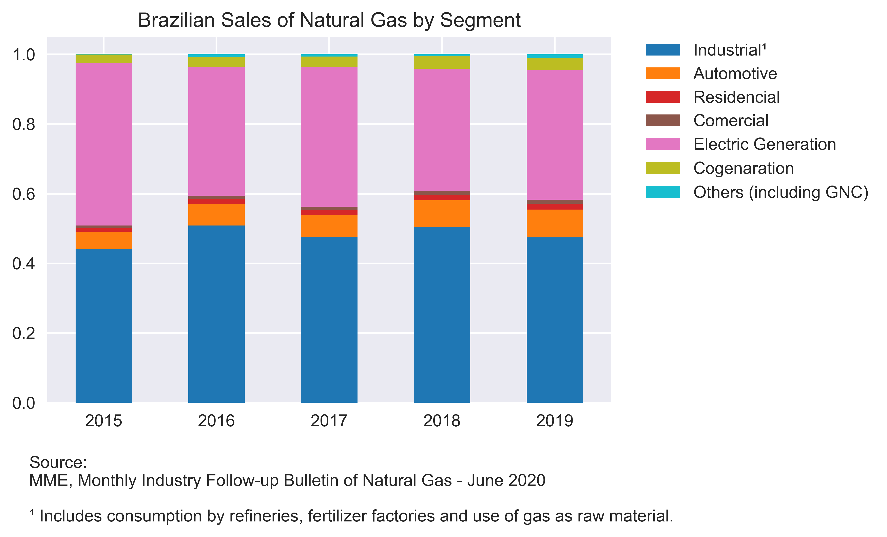

# About

[An Overview of the Brazilian New Gas Market and the Electric Sector](https://medium.com/@lauramsfernandes/an-overview-of-the-brazilian-new-gas-market-and-the-electric-sector-b173f34ac307) it is a blog post made on Sep 9 2020, and has the objective to understand how is settle the Brazilian gas market nowadays and how the market opening can affect the Brazilian Energy Sector. It aims to answer the following questions:

1. How is the demand for Natural Gas in Brazil?
2. Reinjection: Reservoir Strategy or Lack of Structure?
3. How are sales structured by segment?
4. How can the New Gas Market impact the Energy Sector?

## Plots

All plots code can be found on [plot file](2_naturalGas_Plots.ipynb).

## MyDataFrame Class

In order to capture and simplify access to some important informations *(e.g., title, unit)* about the tables collected, and to assembly all functions as methods in a the same place, a class was created. `MyDataFrame` class also perfomes some changes into the original tables to improve their readability and to translate some terms.

Parameters:

>`df`: is a csv file readed by pd.read_csv function.

>`translate`: is a boolean that calls the translate method.

>`translate_first_level`: is a boolean that says if the first level of a MultiIndex DataFrame should be translated or not, since some of them are proper noun and should not be translated.

>`white_space`: is a boolean that replace white space for underscore in all indexes, in case of using loc function.

>`drop_level`: is a boolean that calls the drop_levels method and drops column levels from a MultiIndex DataFrame until becames a Index DataFrame.


        self.translator = Translator()
        self.title = ''
        self.unit = ''
        self.footer = ''
        self.translate = translate
        self.translate_first_level = translate_first_level
        self.white_space= white_space
        self.drop_level = drop_level


Atributes:

>`df`: is the DataFrame it self.

>`translator`: a Translator() instancied object

>`title`: is the DataFrame's title.

>`unit`: is the DataFrame's units.

>`footer`: is the DataFrame's source and notes.

> `self.translate`: is a boolean that allows translation methods.

> `self.translate_first_level`: is a boolean that call the translate_first_level method.

Methods:

>`drop_na()`: drops all rows and columns that have all values equals to NaN.

> `drop_levels()`:  drops all levels that categorize the table itself, and not its values individually. However those informations are allocated as table's title and unit for later use.

>`index_translate_index()`: translate a index DataFrame to English.

>`index_translate_multi_index()`: translate a MultiIndex DataFrame to English.

>`drop_last_column()`: drop the last column if it has been configured as an unnamed column. The value of this column is a ratio that is redundant to our project.

Translations from Portuguese to English will also be performed within the class using [googletrans](https://pypi.org/project/googletrans/) package. The words that are not supported by the package will be translated directly using a dictionary.

```python
class MyDataFrame:
    def __init__(self, df, translate=False, translate_first_level=False, drop_level=True):

        self.df = df
        self.translate = translate
        self.translate_first_level = translate_first_level
        self.drop_level = drop_level
        self.translator = Translator()
        self.title = ''
        self.unit = ''
        self.footer = ''


        if self.df.index.nlevels > 1:
            self.title_unit_multiindex();

        if self.drop_level:
            self.drop_levels()


        if self.translate:
            if self.df.index.nlevels == 1:
                self.translate_index()


        if self.translate:
            if self.df.index.nlevels > 1:
                self.translate_multi_index()


        if self.white_space:
            self.replace_white_space()


        self.drop_na()


    def title_unit_multiindex(self):
        self.title = self.df.columns[0][0]
        self.unit = self.df.columns[1][1]


    def drop_levels(self):
        """
        Drops two column levels that contained the infos previously captured (table's title and unit)
        """
        while self.df.columns.nlevels>1:
            self.df.columns = self.df.columns.droplevel(0)


    def drop_na(self):
        """
        Drops all rows and columns that have all values equals to NaN.
        """
        self.df.dropna(how = 'all', inplace = True)
        self.df.dropna(axis = 'columns', how = 'all', inplace = True)


    def translate_index(self):
        """
        Translates the index of a DataFrame to English.
        """
        self.new_index = []
        for index in self.df.index:
            if index == 'Reinjeção':
                self.new_index.append('Reinjection')
            elif (index == 'Espírito Santo') or (index == 'Espirito_Santo'):
                self.new_index.append('Espirito_Santo')
            elif index == 'Amazonas':
                self.new_index.append('Amazonas')
            elif index == 'Alagoas':
                self.new_index.append('Alagoas')
            elif (index == 'Ceará') or (index == 'Ceara'):
                self.new_index.append('Ceara')
            elif (index == 'Rio Grande do Norte') or (index == 'Rio_Grande_do_Norte'):
                self.new_index.append('Rio_Grande_do_Norte')
            else:
                self.new_index.append(self.translator.translate(index).text)
        self.df.index = self.new_index


    def translate_multi_index(self):
        """
        Translates a MultiIndex DataFrame to English.
        """
        if self.translate_first_level == True:
            for i, num in enumerate(self.df.index):
                    for j in range(self.df.index.nlevels):
                        if j==0:
                            if (self.df.index[i][j] == 'Espírito_Santo') or (self.df.index[i][j] == 'Espirito_Santo'):
                                self.df.index = self.df.index.set_levels(self.df.index.levels[j].str.replace('Espírito_Santo','Espirito_Santo'), level = j)
                            elif self.df.index[i][j] == 'Amazonas':
                                self.df.index = self.df.index.set_levels(self.df.index.levels[j].str.replace('Amazonas','Amazonas'), level = j)
                            elif self.df.index[i][j] == 'Alagoas':
                                self.df.index = self.df.index.set_levels(self.df.index.levels[j].str.replace('Alagoas','Alagoas'), level = j)
                            elif (self.df.index[i][j] == 'Ceará') or (self.df.index[i][j] == 'Ceara'):
                                self.df.index = self.df.index.set_levels(self.df.index.levels[j].str.replace('Ceará','Ceara'), level = j)
                            elif (self.df.index[i][j] == 'Rio Grande do Norte') or (self.df.index[i][j] == 'Rio_Grande_do_Norte'):
                                self.df.index = self.df.index.set_levels(self.df.index.levels[j].str.replace(' ','_'), level = j)
                            else:
                                self.df.index = self.df.index.set_levels(self.df.index.levels[j].str.replace(self.df.index[i][j], self.translator.translate(self.df.index[i][j]).text), level = j)

        for i, num in enumerate(self.df.index):
            for j in range(self.df.index.nlevels):
                if j==0:
                    pass
                if j==1:
                    if self.df.index[i][j] == 'Mar': # checks if one of the words that the translate package can not translate
                        self.df.index = self.df.index.set_levels(self.df.index.levels[j].str.replace('Mar','Offshore'), level = j)
                    elif self.df.index[i][j] == 'Terra': # checks if one of the words that the translate package can not translate
                        self.df.index = self.df.index.set_levels(self.df.index.levels[j].str.replace('Terra','Onshore'), level = j)
                    elif not isinstance(self.df.index[i][j], str):
                        pass
                    else:
                        self.df.index = self.df.index.set_levels(self.df.index.levels[j].str.replace(self.df.index[i][j], self.translator.translate(self.df.index[i][j]).text), level = j)


    def replace_underscore(self):
        """
        Replaces all underscore for white space.
        """
        if self.df.index.nlevels > 1: # tells how many level are
            for i, level in enumerate(range(self.df.index.nlevels)): # runs through levels
                #for j, value in enumerate(self.df.index.levels[i]): # runs through the level's value and replace white space for underline
                self.df.index = self.df.index.set_levels(self.df.index.levels[i].str.replace("_", " "), level = i)

        elif self.df.index.nlevels == 1:
            self.new_index = []
            for index in self.df.index:
                self.new_index.append(index.replace('_', ' '))
            self.df.index = self.new_index


    def drop_unnamed_column(self):
        """
        Drops the last column if its name starts with 'Unnamed'.
        """
        for i,name in enumerate(self.df.columns):
            if type(name) == str and name.startswith('Unnamed'):
                self.df = self.df.drop(self.df.columns[-1], axis=1)


    def index_sups(self):
        """
        Fix all index that has number as supscript.
        """
        if self.df.index.nlevels > 1:
            for name in self.df.index.levels[0]:

                self.df.index = self.df.index.set_levels(self.df.index.levels[0].str.replace('1','¹'), level = 0)
                self.df.index = self.df.index.set_levels(self.df.index.levels[0].str.replace('2','²'), level = 0)
                self.df.index = self.df.index.set_levels(self.df.index.levels[0].str.replace('3','³'), level = 0)
                self.df.index = self.df.index.set_levels(self.df.index.levels[0].str.replace('4','⁴'), level = 0)
                self.df.index = self.df.index.set_levels(self.df.index.levels[0].str.replace('5','⁵'), level = 0)
                self.df.index = self.df.index.set_levels(self.df.index.levels[0].str.replace('6','⁶'), level = 0)
                self.df.index = self.df.index.set_levels(self.df.index.levels[0].str.replace('7','⁷'), level = 0)
                self.df.index = self.df.index.set_levels(self.df.index.levels[0].str.replace('8','⁸'), level = 0)
                self.df.index = self.df.index.set_levels(self.df.index.levels[0].str.replace('9','⁹'), level = 0)

        if self.df.index.nlevels == 1:
            self.df.index = self.df.index.str.replace('1','¹')
            self.df.index = self.df.index.str.replace('2','²')
            self.df.index = self.df.index.str.replace('3','³')
            self.df.index = self.df.index.str.replace('4','⁴')
            self.df.index = self.df.index.str.replace('5','⁵')
            self.df.index = self.df.index.str.replace('6','⁶')
            self.df.index = self.df.index.str.replace('7','⁷')
            self.df.index = self.df.index.str.replace('8','⁸')
            self.df.index = self.df.index.str.replace('9','⁹')

```

## Demand

To understand the behavior of the Brazilian Natural Gas market, is important to analyze the demand for the fuel in recent years. In the article this is done with a selection of the items referring to the demand in the balance sheet table.

At [wrangling file](1_naturalGas_Wrangling.ipynb) under the number `6` you can find the code thats load and set the MyDataFrame instantiated class about the Brazilian Natural Gas demand.

```python
# Demand DataFrame
demand = MyDataFrame(balance.df.loc[:,['Import','Reinjection', 'Gas flaring', 'Own consumption¹', 'NGL²', 'Sales³', 'Adjustments and losses']])

# Setting unit, title and footer
demand.title = 'Brazilian Natural Gas Demand'
demand.unit = '10⁶ m³'
demand.footer = 'Sources: \nANP/SIM, as per Ordinance ANP No. 43/98, for imports data; ANP/SDP, as per Decree No. 2.705/98, for\nproduction, reinjection, gas flaring and losses data; Petrobras, for own consumption, NGL and sales data.\n\n¹ Refers to Petrobras own consumption in production areas, refineries, NGPP (Natural Gas Power Plant),\n transportation and storage. \n² Volume of gas absorbed in NGPPs. \n³ Sales to distributors, nitrofertilizers plants (Fafen) and electricity generation.'
```
```python
demand.df.plot()
plt.xticks(np.arange(2010,2020,1))
plt.ylabel(demand.unit)
plt.title(demand.title)
plt.figtext(0.01,-0.3, balance.footer)
plt.legend(bbox_to_anchor=(1.05, 1), loc='upper left', borderaxespad=0.);
plt.savefig('plots/demand.png',dpi=1200,bbox_inches='tight')
```


## Reinjection

It is import to mention the reinjection question to clarify some miscomprehension about the subject that can lead to wrong assumptions about the Natural Gas demand. Some industry consultants with economy background may think that reinjection is a Natural Gas waste. However is a reservoir technique to maintain its internal pressure and improve oil recovery.

A correlation graph using the `balance` dataframe was plot to prove that reinjection has no relation with any waste metric. For example, if the reinjection had any correlation with gas flaring, it would indicates that reinjection were being made in the same period of time that offshore plataforms was burning gas to relieve the production.

```python
corr = balance.df.corr()
ax = sns.heatmap(
    corr,
    vmin=-1, vmax=1, center=0,
    #sns.palplot(sns.diverging_palette(145, 280, s=85, l=25, n=7))
    cmap=sns.diverging_palette(145, 280, n=200),
    square=True
)
ax.set_xticklabels(
    ax.get_xticklabels(),
    rotation=45,
    horizontalalignment='right'
);

plt.title('Balance Correlation')
plt.savefig('plots/corr.png',dpi=600,bbox_inches='tight')
```


## Sales

Knowing the segments that exist in sales is important to identify where the increase in gas supply may be accommodated in the future. The data was scrapped from a govern report [Monthly Industry Follow-up Natural Gas Bulletin](http://www.mme.gov.br/documents/36216/1119340/06+-+Boletim+Mensal+de+Acompanhamento+da+Ind%C3%BAstria+de+G%C3%A1s+Natural+Junho+2020/4ecd27ca-bd64-bfa7-3510-03799045f87f), and after being collected, a new dataframe was created with the proportion of each segment to generate a stacked bar graph.

```python
# Dict with values scrapp from MME Relatory
sales_segment_ = {'Industrial¹' : [43.61, 40.82, 40.77, 39.75, 36.97, 36.34, 37.17, 35.70, 28.16, 31.22, 34.61, 33.87],
                  'Automotive' : [4.82, 4.96, 5.40, 6.06, 6.26, 5.87, 6.29, 4.83, 3.36, 3.63, 4.34, 4.72],
                  'Residencial' : [0.97, 1.11, 1.18, 1.26, 1.27, 1.00, 1.14, 1.30, 1.38, 1.49, 1.64, 1.33],
                  'Comercial' : [0.79, 0.83, 0.78, 0.84, 0.91, 0.86, 0.87, 0.84, 0.51, 0.32, 0.46, 0.64],
                  'Electric Generation' : [45.90, 29.59, 34.25, 27.69, 29.03, 40.46, 25.63, 19.52, 17.26, 15.70, 18.12, 22.78],
                  'Cogenaration' : [2.50, 2.37, 2.65, 2.84, 2.65, 2.30, 2.12, 2.26, 2.22, 1.65, 2.07, 2.10],
                  'Others (including GNC)' : [0.04, 0.58, 0.53, 0.40, 0.83, 0.42, 0.35, 0.36, 1.22, 0.76, 0.65, 0.63]}

# Creating DataFrame
sales_segment_ = pd.DataFrame(data=sales_segment_)

# Setting Index
sales_segment_.index = [2015,2016,2017,2018,2019,1,2,3,4,5,6,2020]

# Creating DataFrame for Covid Period
sales_seg_covid_ = sales_segment_.loc[[1,2,3,4,5,6]].copy()

# Setting Index to string
sales_seg_covid_.index = ['Jan', 'Feb', 'Mar', 'Apr', 'May', 'Jun']

# Dropping Covid Period from Segment DataFrame
sales_segment_.drop([1,2,3,4,5,6,2020], inplace=True)
```

```python
# Turning Sales Period DataFrame into MyDataFrame
sales_segment = MyDataFrame(sales_segment_)

# Setting unit, title and footer
sales_segment.unit = '10⁶ m³/day'
sales_segment.title = 'Brazilian Sales of Natural Gas by Segment'
sales_segment.footer = 'Source:\nMME, Monthly Industry Follow-up Bulletin of Natural Gas - June 2020\n\n¹ Includes consumption by refineries, fertilizer factories and use of gas as raw material.'
```
After that it was calculated the segment proportion.
```python
sales_per = sales_segment.df.copy()

# Calculation proportion
years=np.arange(2015,2020,1)
for i, year in enumerate(years):
    sales_per.loc[year] = sales_segment.df.iloc[i,:].div(sales_segment.df.iloc[i,:].sum())

# Converting into MyDataFrame
sales_per = MyDataFrame(sales_per)

# Setting unit, title and footer
sales_per.unit = '%'
sales_per.title = 'Brazilian Sales of Natural Gas by Segment'
sales_per.footer = 'Source:\nMME, Monthly Industry Follow-up Bulletin of Natural Gas - June 2020\n\n¹ Includes consumption by refineries, fertilizer factories and use of gas as raw material.'
```


## Energy Sector

The Brazilian electric system is very dependent on  intermittent energy sources (e.g., hydro). Opening up the Natural Gas market, consequently increasing its supply, is an opportunity to reduce this dependency.

To show how dependent the electricity production are from hydropower, two dataframes, one of energy production in the last decade and the other of monthly average of precipitation in the country are created at [wrangling file](1_naturalGas_Wrangling.ipynb) under the numbers `10` and `14`. With these two data, it is possible to have an idea of the system vulnerability.

'''python
energy_source = pd.read_csv(r'data_set/GeracaoFonte.csv')

# Translating Manually
energy_source.columns = ['ID', 'Energy Type', 'GWh', 'Month', 'Year', 'dthProx']

# Converting into MyDataFrame
energy_source = MyDataFrame(pd.pivot_table(energy_source, values='GWh', index=['Energy Type'], columns=['Year', 'Month']), drop_level=False)

# Translating Index Manually
energy_source.df.index = ['Biomass','Coal','Energy Produced Out of SIN','Eolic','Natural Gas','Hidrelectric','Itaipu','Nuclear','Diesel/Oil','Waste Industrial Processes','Solar']

# Transposing DataFrame
energy_source.df = energy_source.df.T

# Adding all Hydro Sources into one column
energy_source.df['Hydroelectric'] = (energy_source.df.loc[:,'Itaipu'] + energy_source.df.loc[:,'Hidrelectric'])
energy_source.df.drop(['Hidrelectric','Itaipu'], axis=1, inplace=True)

# Dropping 2019
energy_source.df.drop(2019,inplace=True)

# Setting unit, title and footer
energy_source.unit = 'GWh'
energy_source.title = 'Electric Energy by Source'
energy_source.footer = 'Source: ANEEL\nNotes: History of the electric energy volume produced in the country in GWh, expressed by the values of energy load \ndispatched in the National Interconnected System - SIN, classified by renewable sources or not and the volume \nproduced by the generators not yet interconnected.'
'''
'''python
skip = np.arange(0,21,1)
precip = MyDataFrame(pd.read_csv(r'data_set\precip.csv', skiprows=skip))

# Setting Columns Name
precip.df.columns = ['Year','Jan','Feb','Mar','Apr','May','Jun','Jul','Ago','Sep','Oct','Nov','Dec']

# Setting DataFrama Index
precip.df.index = precip.df.loc[:,'Year']

# Dropping Year Column
precip.df.drop('Year', axis=1, inplace=True)

# Setting unit, title and footer
precip.unit='mm/month'
precip.title='Average Preciptation Rate Monthly'
precip.footer='Source: \nThe data used in this visualization were produced with the Giovanni online data system, \ndeveloped and maintained by the NASA GES DISC.'
'''
'''python
energy_source.df.sum(axis=0, level=0).plot(kind='area', figsize=(10,5), colormap='tab10')
plt.figtext(0.05,-0.1, energy_source.footer)
plt.ylabel(energy_source.unit)
plt.xticks(np.arange(2000,2019,1))
plt.title(energy_source.title)
plt.legend(bbox_to_anchor=(1.01, 1), loc='upper left', borderaxespad=0.);
plt.savefig('plots/energy_source.png',dpi=600,bbox_inches='tight')
'''
'''python
precip.df.mean().plot(kind='bar')
plt.ylabel(precip.unit)
plt.title('Brazilian Monthly Average Precipitation')
plt.figtext(0.05,-0.02, precip.footer);
plt.savefig('plots/avg_precip.png',dpi=1200,bbox_inches='tight');
'''